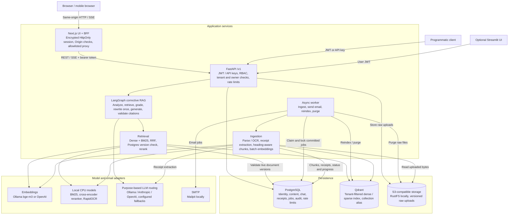
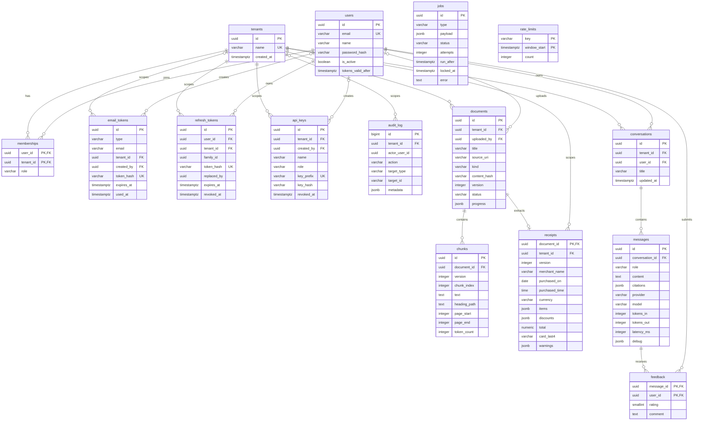

# FolioNest

Multi-tenant document Q&A with receipt extraction. Users upload documents and receipt photos, then ask questions in a chat UI. Answers are streamed, grounded in those documents, and cited. Access is controlled by tenant-scoped roles. This repo implements [`docs/ARCHITECTURE.md`](docs/ARCHITECTURE.md).

The default UI is Next.js; Streamlit is available through the optional `legacy` Compose profile. See the [HLD](#high-level-design-hld) and [ERD](#entity-relationship-diagram-erd) below.

## Features

**Chat over your documents**

- Corrective RAG: query analysis, hybrid retrieval (dense + BM25, fused with RRF), cross-encoder reranking, relevance grading, and at most one query rewrite before answering.
- Streamed answers over SSE, with citations validated against the retrieved chunks. Uncited answers become an explicit "not in your documents" response.
- Document-scoped questions are supported through the chat API (`filters.doc_id`). Greetings and other messages that need no retrieval use a direct response path.
- Sparse embedding failures fall back to dense retrieval; reranker failures retain retrieval ordering. Retrieved hits are checked against the tenant, ready status, and current document version in Postgres.
- The UI shows the current step and the model in use, including fallbacks. Every answer records its provider, model, token usage and latency.
- Chat history: every chat is saved and listed by last activity, grouped by day, searchable by title, renameable and deletable. Open any past chat (`/c/{id}`) and keep asking; follow-ups use its earlier turns. Long chats load the latest 200 messages with "Load earlier".
- Per-message thumbs up/down feedback.
- Model routing with fallbacks (`config/models.yaml`): local Ollama first for orchestration, Claude → OpenAI → local for generation. Runs fully local with no cloud keys.

**Documents**

- Drag and drop PDF, DOCX, HTML, Markdown or plain text on Upload docs (25 MB max). The API detects the type from content, never from the client header. Image ingestion remains supported by the document API for existing clients; structured receipt extraction runs only for receipt uploads.
- Scanned PDFs and images are OCR'd (RapidOCR, CPU), subject to page and image-size limits. Heading-aware chunking preserves section paths and page references, with token limits and overlap; embeddings are processed in batches.
- Background ingestion with live progress, retries, versioning (re-uploading changed content creates version N+1), idempotent re-upload, and retry by re-uploading a failed file.
- Deletion removes chunks, vectors and raw files asynchronously.

**Receipts** ([details](#receipts))

- Upload PDF, JPEG, PNG or WebP on Scan receipts, with desktop drag and drop and mobile camera/gallery controls. A vision model extracts merchant, date and time, line items, discounts, subtotal, tax, tip, total, payment method, and card brand with the last 4 digits.
- Arithmetic is cross-checked and mismatches are flagged, never "fixed". Luhn-valid full card numbers are masked in extracted OCR text; raw uploaded files are retained in object storage.
- Receipt uploads have their own status list and never appear in the Documents library. Extracted receipts remain searchable from chat.

**Accounts and workspaces**

- Self-serve signup with email verification creates a private workspace where you are admin ([details](#signup)). Set `SIGNUP_ENABLED=false` for invitation-only use.
- Email invitations into existing workspaces, password reset, and switching between workspaces.
- Settings for every role: light/dark/device theme, editable profile name, verified email display, and current-password-verified password changes that revoke all sessions. Administrator API keys include help on hover/focus.
- Roles: **viewer** (chat, read documents), **editor** (+ upload/delete documents), **admin** (+ members, API keys, audit log). Guards prevent removing or demoting the last admin.
- API keys for programmatic access, scoped to a tenant and role: create, list, copy the secret once, and revoke. Secrets are stored as hashes; user-owned chat and profile/password changes require a user session.
- Member management includes pending invitations (with revocation; re-inviting supersedes the earlier link), role changes, removal, and paginated lists. Audit history supports loading older events.
- An audit log of security-relevant events.

**Platform**

- Tenant isolation is enforced in Postgres and Qdrant. Another tenant's IDs return 404.
- Postgres outbox for jobs and email, rate limits shared across replicas, and structured JSON logs with secret redaction.
- Re-embedding (`rag reindex`) through a Qdrant alias swap, with bounded batches and retry recovery. Model/dimension changes require coordinated API/worker settings and a query pause ([operations](#operations)).
- Retrieval and faithfulness evals (`evals/run_eval.py`).
- Next.js web UI that keeps API tokens out of the browser (backend-for-frontend), with CSRF, CSP and XSS controls ([details](#web-ui)).
- Liveness and dependency readiness endpoints, bounded local model warmup, non-root containers, persistent local infrastructure volumes, and automatic database migrations on Compose API startup.
- CLI commands for administrator/workspace creation and queued reindexing; a local workspace smoke-test script.
- CI checks for Python and web lint, formatting, types, tests, web builds, and dependency audits; optional retrieval/faithfulness evaluation gate.
- OWASP Web/API Top 10 controls ([mapping](#owasp-coverage)), including escaped document context and static parameterized worker updates.

## Technology stack and rationale

These are the technologies used by the implementation. Versions come from `pyproject.toml`, `uv.lock`, `web/package.json`, and `compose.yaml`; model routes come from `config/models.yaml`.

| Area | Technology used | Why this choice fits the project |
| --- | --- | --- |
| Backend language | Python 3.12 | Keeps document parsing, OCR, model SDKs, and the API in the same language, with type checking for application code. |
| API and validation | FastAPI, Uvicorn, Pydantic v2 | Async request handling supports model/storage calls and SSE streaming; explicit schemas validate requests and structured model output. SSE delivers answers over ordinary HTTP. |
| RAG orchestration | LangGraph | Makes query analysis, retrieval, grading, the single rewrite, and citation validation explicit graph steps. Conversation history is loaded from Postgres; no graph checkpointer is used. |
| Model adapters | Ollama, Anthropic, and OpenAI SDKs behind an `LLM` protocol | Purpose-based routes and fallbacks let orchestration and receipt extraction start locally while generation can use cloud models. The adapters keep provider-specific request formats outside graph logic. |
| Default model routes | Ollama `qwen3.5:4b` for orchestration; Claude Sonnet 5.5 → OpenAI → Ollama for generation; Ollama `qwen3-vl` → Claude → OpenAI for receipts | Local routes permit document chat and receipt processing without cloud keys. Cloud fallbacks are available when configured; latency and output quality depend on the selected model and hardware. |
| Dense embeddings | Ollama `bge-m3` (default, 1024 dimensions), or OpenAI embeddings | The local default avoids a cloud dependency for indexing. Embedding settings are configurable; changing the model or dimensions requires reindexing and coordinated rollout. |
| Keyword retrieval and reranking | `fastembed` BM25 and `BAAI/bge-reranker-base` on ONNX/CPU | BM25 adds exact-term matching to semantic retrieval. A cross-encoder reranks candidates without a PyTorch runtime; failures fall back to the available retrieval results. |
| Search index | Qdrant | Supports dense/sparse hybrid search, RRF fusion, tenant payload filters, and collection aliases for index replacement. It holds derived search state while Postgres determines document visibility. |
| Relational persistence | PostgreSQL 16, SQLAlchemy 2 async, `asyncpg`, Alembic | Transactions keep business changes and jobs together; relational constraints support identity, memberships, documents, receipts, and chat. Alembic versions schema changes. |
| Background jobs and rate limits | PostgreSQL `jobs` and `rate_limits` tables; async Python worker | Row locks and `SKIP LOCKED` support concurrent workers and retries. Shared database counters work across API replicas without an additional queue or cache service in the MVP. |
| Raw file storage | S3 API through `boto3`; RustFS locally | Keeps large raw files outside relational rows, with tenant/document/version object keys. The storage adapter allows a configured S3-compatible endpoint. |
| Parsing, OCR, and chunking | PyMuPDF4LLM, `python-docx`, `trafilatura`, Pillow, RapidOCR, `tiktoken` | Format-specific parsers recover document text; CPU OCR handles scans and photos. Token-aware chunks retain heading/page context and bound embedding input sizes. |
| Authentication | `pwdlib`/Argon2id, PyJWT, hashed refresh tokens and API keys | Password hashing, short-lived access tokens, rotating refresh-token families, and revocable tenant-scoped keys implement the account and session requirements. |
| Web application | Node.js 22+, Next.js 16 App Router, React 19, TypeScript | The same app serves workspace pages and a server-side BFF that holds API tokens in an encrypted HttpOnly cookie. TypeScript checks UI and API contracts. |
| UI styling and data | Tailwind CSS 4, TanStack Query, `react-markdown` | Utility styles support responsive themes; query caching and invalidation keep workspace lists current; Markdown displays answers without enabling raw HTML. |
| BFF validation and sessions | Zod and `jose` | Zod validates server configuration; `jose` provides authenticated encryption for session cookies. Origin checks and an allowlisted proxy constrain browser requests. |
| Transactional email | `aiosmtplib`, Jinja2; Mailpit locally | SMTP works through configured mail infrastructure; HTML templates autoescape values. Email jobs commit with business changes, and Mailpit captures local verification/invitation/reset messages. |
| Optional legacy UI | Streamlit | Retains a Python-based interface for existing workflows; the default workspace UI is Next.js. |
| Containers and local infrastructure | Podman + Compose, OCI Containerfiles | Reproduces the API, worker, web app, database, search, storage, and email services locally, with persistent volumes and constrained application containers. |
| Quality and delivery checks | `uv`, Ruff, strict mypy, pytest; ESLint, Prettier, TypeScript, Vitest; GitHub Actions and dependency audits | Lockfiles make dependency resolution reproducible. CI checks types, formatting, behavior, builds, and dependencies, including integration tests with provisioned services. |
| Observability and evaluation | Structured JSON logs, request/trace IDs, stored model usage; retrieval metrics and an LLM faithfulness judge | Provides operational and answer-quality evidence with the current stack. OpenTelemetry, Langfuse, and RAGAS are not implemented. |

## High-level design (HLD)



**Upload flow:** the API validates and stores the file, then commits document metadata and an ingestion job together. The worker parses/OCRs the file, optionally extracts receipt fields, chunks and embeds the content, updates Qdrant, and marks the current document version ready. Deletion marks the document deleted and queues cleanup of chunks, receipt fields, vectors, and raw versions.

**Chat flow:** the API loads the user's conversation history and invokes the graph. Retrieval searches only the authenticated tenant and excludes hits whose document is no longer ready or current in Postgres. The graph may rewrite an unsuccessful query once; generation streams provisional tokens, then validates citation indices and sends the canonical answer. Messages, citations, model usage, and feedback are persisted in Postgres.

**Service boundaries:** the browser uses the BFF; direct API clients authenticate separately. PostgreSQL is the source of truth and job queue; Qdrant is derived search state and S3 holds raw files. Workers process committed jobs with row locks and bounded retries. Model routing is deployment-wide, and cloud routes require credentials. The graph has no SQL or side-effecting tools.

## Entity relationship diagram (ERD)

This diagram includes all 15 implemented PostgreSQL tables, with selected columns from [`src/rag/db/models.py`](src/rag/db/models.py). Relationships represent declared foreign keys. `PK` and `FK` mark primary and foreign keys; `UK` marks a single-column unique constraint. Nullable parent references use `o|`.



- `memberships` implements workspace roles; a user can belong to multiple tenants. Email tokens cover signup, invitations, and password reset. Refresh-token families provide rotation, replay detection, and session revocation.
- Documents distinguish `document` and `receipt` libraries. Live file hashes are unique per `(tenant_id, content_hash, kind)`; chunks are unique per `(document_id, version, chunk_index)`. A receipt row belongs to one document and is visible only for its ready current version.
- Conversation ownership is checked using both tenant and user. Deleting a conversation cascades to its messages and feedback. Citations and receipt line items are JSONB values, not separate relational tables.
- `jobs.payload` carries document IDs, versions, email context, or reindex targets without database foreign keys. `audit_log.actor_user_id` and `refresh_tokens.replaced_by` also have no declared foreign keys. Rate-limit buckets use a composite key and include tenant/user/IP/email scope in their key string.
- Qdrant points and S3 objects are outside the relational ERD. Vectors carry tenant, document ID, version, and chunk metadata; raw object keys use `{tenant_id}/{document_id}/v{version}`.

## Implemented scope and limits

The features above are implemented. SSO/OIDC, custom roles, per-document ACLs, GraphRAG, web-search/action agents, tenant-specific model routing, multi-region deployment, OpenTelemetry, and Langfuse are deferred. Default retrieval is tenant-wide; API clients may filter by document. Citation validation checks supplied source indices, while factual faithfulness is evaluated separately. The web app has no offline/PWA workflow.

## Quickstart

```bash
./start.sh
```

`start.sh` does the following:

1. Checks that Podman is installed and running. On macOS it starts the Podman machine if it's stopped.
2. Creates `.env` from `.env.example` with generated secrets if it doesn't exist yet.
3. Checks that the ports are free, and warns if Ollama or its models are missing.
4. Starts Postgres, Qdrant, RustFS and Mailpit, and waits for them to be healthy.
5. Runs ruff, strict mypy, and the full unit + integration suite, then the web UI's lint, typecheck, format check and unit tests (if `npm` is installed).
6. Builds the images, starts the API, worker and web UI, waits for health, and opens the web UI in your browser.

| Command | What it does |
| --- | --- |
| `./start.sh` | Everything above |
| `./start.sh --skip-tests` | Start without running checks and tests |
| `./start.sh --no-build` | Reuse the existing `localhost/rag-mvp:latest` and `localhost/rag-web:latest` images |
| `./start.sh --no-browser` | Don't open the browser |
| `./start.sh test` | Prerequisite checks, infrastructure, and tests only |
| `./start.sh stop` | Stop the stack. Data volumes are kept |

Once it's running:

| URL | What |
| --- | --- |
| http://localhost:3000 | Web UI. Use **Sign up**, or create an admin (below) |
| http://localhost:8501 | Optional legacy Streamlit UI (`podman compose --profile legacy up -d ui`) |
| http://localhost:8000/docs | OpenAPI (disabled when `ENV=prod`) |
| http://localhost:8025 | Project Mailpit inbox (signup verification, invites and password resets). Override with `MAILPIT_UI_PORT` |

```bash
podman compose exec api rag admin create --email you@example.com --tenant demo   # prompts for the password
```

**Local models.** Chat, embeddings and receipt extraction default to Ollama on the host. Tests don't need it.

```bash
OLLAMA_HOST=0.0.0.0 ollama serve
ollama pull qwen3.5:4b && ollama pull bge-m3 && ollama pull qwen3-vl
```

Add `ANTHROPIC_API_KEY` and/or `OPENAI_API_KEY` to `.env` to enable the cloud routes.

**Ollama and containers.** Ollama runs on the host so it can use the Metal GPU. Containers reach it through `host.containers.internal`, which only works when Ollama listens on all interfaces. That also exposes Ollama, which has no authentication, to your LAN. Keep the macOS firewall on, or use a cloud `orchestration` route instead.

### Manual setup (Podman)

```bash
cp .env.example .env            # then fill JWT_SECRET, POSTGRES_PASSWORD, QDRANT_API_KEY, S3_SECRET_KEY (+ provider keys)
podman build -t localhost/rag-mvp:latest -f Containerfile .
podman compose up -d --no-build
```

### Running on the host (development)

```bash
uv sync --extra dev
podman compose up -d postgres qdrant objectstore mailpit
set -a; . ./.env; set +a
alembic upgrade head
uvicorn rag.api.main:app --reload --no-server-header &
python -m rag.worker &
(cd web && npm ci && SESSION_SECRET=$SESSION_SECRET APP_ORIGIN=http://localhost:3000 API_URL=http://localhost:8000 npm run dev)   # http://localhost:3000
(cd ui && API_URL=http://localhost:8000 streamlit run app.py)                                     # legacy, :8501
```

## API

All routes are versioned under `/v1`. Protected routes require a JWT (`Authorization: Bearer`) or an API key (`X-API-Key`). Chat, chat history, feedback, profile edits, and session/password management require a user session. Signup, verification, login, refresh, forgot/reset password, invitation acceptance, and health checks are public; token-based flows validate their supplied credentials.

| Area | Endpoints | Permission |
| --- | --- | --- |
| Auth | `POST /auth/signup`, `/auth/signup/verify`, `/auth/login`, `/auth/refresh`, `/auth/logout`, `/auth/switch-tenant`, `/auth/password/forgot`, `/auth/password/reset`, `/auth/password/change` | public, except logout/switch/change |
| Invitation acceptance | `POST /invitations/accept` | public; single-use invitation token (existing accounts must also give their current password) |
| Profile | `GET /me`, `PATCH /me` (name) | any role; edits require a user session |
| Chat | `POST /chat` (SSE: `status`, `model`, `token`, `answer`, `citations`, `done`, `error`, and development-only `debug`; pass `conversation_id` to continue a chat), `POST /messages/{id}/feedback` | `chat:use`, user session |
| Chat history | `GET /conversations?limit&q&before&before_id` (most recent first, keyset paging, title search), `GET /conversations/{id}?limit&before`, `PATCH`/`DELETE /conversations/{id}` | `chat:use`, user session, own only |
| Documents | `POST /documents`, `GET /documents[/{id}]`, `DELETE /documents/{id}` | `document:read` / `write` / `delete` |
| Receipts | `POST /receipts`, `GET /receipts`, `GET /receipts/{document_id}`; upload status via `GET /documents?kind=receipt` | `document:write` / `read` |
| Members | `GET /members`, `PATCH`/`DELETE /members/{user_id}`, `POST`/`GET /invitations`, `DELETE /invitations/{id}` | `member:manage` |
| API keys | `GET`/`POST /api-keys`, `DELETE /api-keys/{id}` | `apikey:manage` |
| Audit | `GET /audit-log?limit&before_id` (newest first, ID cursor) | `audit:read` |
| Health | `GET /healthz`, `GET /readyz` (unversioned) | public |

For document answers, clients must use the SSE `answer` event to replace provisional `token` text after citation validation. Direct responses and insufficient-context paths stream tokens followed by `done` without a separate `answer` event. An `error` event reports a failed turn.

## Tests and checks

```bash
./start.sh test          # starts the test infrastructure, then runs everything below
uv run ruff check src tests ui evals scripts
uv run ruff format --check src tests ui evals scripts
uv run mypy src   # mypy runs in strict mode
uv run pytest            # unit tests, plus integration tests against the compose services (uses database rag_test)
(cd web && npm run lint && npm run typecheck && npm test && npm run build)
uv run python evals/run_eval.py --tenant-id <uuid> --provider anthropic --min-recall 0.85 --min-faithfulness 0.90
```

The integration suite covers these flows end to end, including real emails read back from Mailpit:

- signup → verification email → private workspace → login, plus disabled signup, expired/reused links and rate limits
- invite → email → accept → login
- password reset, with session revocation
- refresh-token rotation and reuse detection; logout and replay revoke access tokens immediately
- the RBAC matrix: every route × every role
- tenant and owner isolation (BOLA)
- chat history: activity ordering, keyset paging, search, rename/delete cascade, continuing a chat with its history, owner-only rename/delete/continue
- upload type spoofing, idempotent re-upload, versioning and failed-upload retry
- receipt upload → OCR → extraction → receipts API, including tenant isolation and delete cascade
- concurrency regressions: concurrent uploads, worker lease expiry, reindex recovery and stale-vector filtering
- worker payload handling: email secrets are scrubbed on completion and terminal failure, retained for retries; other job payloads are preserved

Unit tests also verify escaping of retrieved text, headings, and source attributes against delimiter and attribute injection.

`tests/unit/test_route_coverage.py` fails CI if someone adds a route without an auth dependency.

## Signup

The sign-in page includes **New here? Sign up**. Enter your email, open the verification link
from Mailpit (or your configured SMTP provider), then choose a workspace name and password.
For local development, open **http://localhost:8025** to read the email. Mailpit captures
messages instead of delivering them to your normal inbox. Its messages persist in this
project’s `mailpit` Podman volume across container restarts.
Verification creates a new private workspace and makes you its admin. It never adds you to
an existing workspace; those still require invitations. Workspace names include a unique suffix.

Signup links expire after 30 minutes and are single-use. Accounts and workspaces are created
only after email verification. Existing-email requests receive the same 202 response without
changing the account. Passwords follow the existing 12–128 character policy and are hashed
with Argon2id. Signup initiation and verification are rate-limited.

Set `SIGNUP_ENABLED=false` for invitation-only operation. Apply `alembic upgrade head` when
running on the host; Compose upgrades to the latest migration on API startup (currently `0005`).

## Receipts

Upload a receipt photo (JPEG, PNG, WebP) or PDF in **Scan receipts**. The worker:

1. OCRs images and text-less PDF pages with RapidOCR (PaddleOCR PP-OCR models on ONNX Runtime, CPU, bundled in the wheel).
2. Sends the image plus the OCR text to the `receipt_extraction` route in `config/models.yaml`:
   `ollama/${OLLAMA_VISION_MODEL}` (default `qwen3-vl:latest`) → Claude Sonnet 5.5 → OpenAI `${OPENAI_VISION_MODEL}`.
   Cloud entries are skipped without a key; Ollama falls through when the model isn't pulled or Ollama is down.
3. Validates the structured output (merchant, date/time, line items, discounts, subtotal, tax, tip, total, item count,
   payment method, card brand and last 4) and cross-checks the arithmetic. Mismatches become `warnings`; numbers are
   never rewritten. Only the last 4 card digits are stored, and Luhn-valid full card numbers in OCR text are masked.
4. Stores a `receipts` row and indexes a Markdown summary plus the OCR text, so chat can answer questions about it.

`documents.progress` records the live processing step and model; Scan receipts shows upload status separately from Documents.
`GET /v1/receipts` and `GET /v1/receipts/{document_id}` need `document:read`. Receipt processing latency depends on the model, hardware, and image size; the default local extraction timeout is 300 seconds. If no model can answer, the OCR text is still indexed without structured fields.
The container image installs `libgl1` and `libglib2.0-0t64`, which OpenCV needs.

## Web UI

`web/` is a Next.js 16 app that serves the UI and acts as a backend-for-frontend (BFF). Design and full OWASP mapping: [architecture §6](docs/ARCHITECTURE.md#6-ui-nextjs-bff).

- **API tokens are inaccessible to browser JavaScript.** Sign-in goes through `/api/auth/*`; the BFF keeps the access and refresh tokens in one AES-256-GCM encrypted, `HttpOnly`, `SameSite=Strict` cookie (`__Host-` + `Secure` over https). Refresh is single-flight within one process; multiple web replicas require session affinity or shared refresh coordination.
- **Allowlisted proxy.** `/api/v1/*` forwards only listed method/path pairs with UUID-shaped IDs and streams JSON, multipart uploads and SSE. Actual bytes are capped at 16 KB for JSON and 30 MB for uploads. Queries over 2 KB return 414.
- **Client identity.** `TRUSTED_PROXY_HOPS=0` ignores forwarded IPs by default: direct clients share the BFF's API IP bucket. Enable a positive hop count only behind a trusted ingress that overwrites/appends the actual peer IP and prevents direct access to the web service. A single such ingress normally uses `1`; Next.js does not append a hop to an existing header. Compose passes this setting to `web`. Never enable it for direct public access.
- **CSRF:** `SameSite=Strict` plus an exact `Origin` check on every mutating request.
- **XSS:** per-request nonce CSP with `strict-dynamic`, no remote images, markdown rendered without raw HTML, and `dangerouslySetInnerHTML` banned by lint.
- Env: `SESSION_SECRET` (generated by `start.sh`), `APP_ORIGIN` (must be https in prod), `API_URL`, `ENV`, `TRUSTED_PROXY_HOPS`. Compose maps the root `.env` setting `WEB_ORIGIN` to the web process's `APP_ORIGIN`.

FolioNest uses a teal/indigo/amber logo, a home hero and workspace footer links. Mobile bottom navigation shows **Home, Upload docs, Scan receipts, Members, Settings**, with Members restricted to managers. All roles can access personal settings; administrator API keys and audit history retain their permissions. Receipts upload directly on Scan receipts and stay in a separate library. Native camera/gallery inputs share only selected files; OS/browser controls permission prompts and gallery visibility. Camera capture depends on mobile browser support. HEIC is rejected with a format error; export it as JPEG/PNG/WebP first.

Migration `0005` adds profile names and upload kinds, moves existing extracted receipts to the receipt library, and scopes file deduplication to each library. Take a backup before applying it with `.venv/bin/alembic upgrade head` (Compose runs upgrades on API startup). Downgrading is possible only when there are no duplicate file hashes across the two libraries; otherwise restore the pre-migration backup.

Streamlit is now optional (`podman compose --profile legacy up -d ui`); the default launcher starts the Next.js workspace app.

To repeat the live local workspace smoke test after starting the stack:

```bash
uv run python scripts/smoke_workspace.py
```

It creates unique temporary workspaces, checks invitations through Mailpit, member roles/removal, key creation/revocation, receipt reads, audit records, permissions and CSRF, then removes its accounts/workspaces. The receipt fixture is seeded; `tests/integration/test_receipts.py` separately exercises upload and real OCR with model extraction faked. Run this against the local development stack with its matching host-side `DATABASE_URL`.
Legacy Streamlit renders untrusted chat, citations and receipt text as plain text, preventing Markdown image requests from leaking document content. Rich answer Markdown remains available in the Next.js UI.

## OWASP coverage

The table below maps implemented controls to Web 2021 and API 2023 identifiers. Deployment constraints and scope are documented in [the architecture](docs/ARCHITECTURE.md).

| Risk (Web 2021 / API 2023) | Implementation |
| --- | --- |
| **API1 BOLA / A01** | `tenant_id` and `user_id` always come from the token, never the request body. Tenant-owned resource queries filter by the authenticated tenant. Retrieval also checks Postgres for ready documents at the exact indexed version, excluding partial, failed, deleted and superseded content. Conversations and feedback also filter by `user_id`, so admins can't read other users' chats. The Qdrant tenant filter is applied inside `VectorStore`. Another tenant's IDs return 404, the same as missing IDs. UUIDv4 IDs. |
| **API2 Broken auth / A07** | argon2id with transparent rehash. 12–128 character policy (rejects passwords containing the email local-part). JWT is HS256 with the algorithm pinned and `iss`/`aud`/`exp`/`nbf`/`iat`/`jti`/`sid` required plus a `typ` check. Access TTL is 15 min. Sub-second `iat` makes revocation via `tokens_valid_after` (password reset) exact. Refresh tokens are opaque and stored as SHA-256 hashes. They rotate on every use, and reusing a rotated token revokes the whole token family. JWT `sid` binds access tokens to that family; each request checks a live refresh record, so logout and replay detection also revoke access immediately. Password reset invalidates all outstanding reset links and serializes against login/refresh. Refresh cookie: `HttpOnly`, `SameSite=Strict`, path-scoped. Login failures look identical whether or not the account exists, including timing (a dummy hash is verified). |
| **API3 BOPLA** | Every input schema sets `extra="forbid"` (no mass assignment). Explicit response models, so hashes and secrets never serialize. Validation errors never echo submitted values. |
| **API4 Resource consumption** | Postgres fixed-window rate limits shared across replicas: login per IP and per email, signup per IP and per email, verification/reset/accept per IP, forgot-password per IP and per email, chat per tenant and per user, uploads per tenant. 25 MB upload cap (streamed and bounded) plus an actual-byte request-body cap, including chunked multipart requests without an honest Content-Length. Zip-bomb guard on DOCX. Pagination caps. 4k-character questions. LLM `max_tokens` and timeouts. Graph `recursion_limit`, with at most 1 rewrite. |
| **API5 BFLA** | `require(Permission)` dependency on every route. The role is read from the DB on every request, so a demotion or removal applies immediately. RBAC matrix test, route-coverage test, last-admin and self-change guardrails. |
| **API6 Sensitive flows** | Invite and reset are single-use, short-lived and hashed at rest. Forgot-password always returns 202 (no account enumeration). |
| **API7 SSRF / A10** | No user-supplied URLs are ever fetched. HTML is parsed from the uploaded bytes only. Email links are built only from `PUBLIC_UI_URL`. |
| **API8 Misconfig / A05** | API security headers (CSP `default-src 'none'`, `nosniff`, `DENY`, `no-referrer`, `no-store`, HSTS in prod). CORS allowlist. `TrustedHostMiddleware`. No server header. Docs and OpenAPI off in prod. Startup refuses a weak `JWT_SECRET`, and in prod rejects wildcard CORS/hosts, non-HTTPS UI/CORS URLs, missing Qdrant authentication and default S3 secrets. Containers run non-root with `cap_drop: ALL` and `no-new-privileges`, and ports bind to 127.0.0.1. |
| **API9 Inventory** | Versioned `/v1` and a single router registry. OpenAPI is hidden in prod. |
| **API10 Unsafe API consumption** | Every LLM structured output is re-validated with Pydantic. Fallbacks on timeout, error or refusal. |
| **A03 Injection** | SQLAlchemy bound parameters only. Prompt injection: retrieved text, headings, and source attributes are HTML/XML-escaped inside `<doc>` blocks labelled as data. Encoding protects markup boundaries but does not guarantee that the model ignores malicious prose. No side-effecting tools. Citation indices are validated deterministically; the SSE `answer` event carries the canonical cleaned text, and the UI replaces provisional text with it. Uncited document answers become insufficient-context responses. Valid indices alone do not prove factual faithfulness. Jinja autoescapes HTML email. Email subject header-injection guard. Streamlit never uses `unsafe_allow_html`. |
| **A04 Insecure design** | MIME is sniffed from content rather than trusted from the header. Filenames are sanitized. Storage keys are never derived from filenames. |
| **A06 Vulnerable components** | `uv.lock`, plus `pip-audit --strict` in CI. Web: `package-lock.json` and `npm audit --omit=dev --audit-level=high` in CI. |
| **A08 Integrity** | Outbox pattern: emails and jobs commit atomically with the business change. Deterministic Qdrant point IDs. |
| **A09 Logging** | JSON logs with redaction of bearer tokens, JWTs, API keys and `password=`/`token=`. The access log omits query strings. Audit log: failed logins, refresh-token reuse, invites, joins, role changes, removals, API key create/revoke, document delete, password reset. Delivered email payloads are scrubbed from `jobs`. |

## Deviations from the architecture doc

- **Object storage: RustFS instead of MinIO.** RustFS is the local S3-compatible store. Any S3 endpoint works through the `S3_*` env vars.
- **Reranker: `BAAI/bge-reranker-base`** (via fastembed/ONNX, CPU) instead of `bge-reranker-v2-m3`. fastembed doesn't ship v2-m3, and the swap avoids pulling in PyTorch. It's configurable with `RERANKER_MODEL`. `GRADE_THRESHOLD` (default 0.0, in logit units) should be tuned on the eval set.
- **Generation route has a final local fallback (`ollama/qwen3.5:4b`).** This lets the stack run with no cloud keys. Remove it in `config/models.yaml` if that's not wanted. Sonnet 5.5 runs at `effort: low` for latency. Server-side refusal fallback (beta) is enabled on that entry; set `refusal_fallback: false` to disable it.
- **No LangGraph Postgres checkpointer.** Conversation state is reloaded from `messages` on every turn, which is all the graph needs today.
- **Email links use `?token=`, not a URL fragment.** The links point at the web UI, which reads the token server-side, strips it from the address bar on load, and sends `Referrer-Policy: no-referrer`. Tokens are single-use and short-lived, and the API only ever receives them in POST bodies.
- **Two extra endpoints:** `POST /v1/auth/switch-tenant` and `GET /v1/invitations` (the pending list in the Members page). Job types also include `purge_document`, which handles async raw-file and chunk cleanup after a delete.
- **Faithfulness** is scored by a small LLM-judge in `evals/run_eval.py` on the `eval_judge` route, not the RAGAS library.
- **Observability:** structured JSON logs with request and trace IDs, and per-message provider, model, fallback, token and latency data stored on `messages`. OpenTelemetry and Langfuse wiring are not done yet.

## Operations

- **Re-embed or switch embedding model:** set `EMBEDDING_*`, then run `rag reindex --version 2`. The worker builds `chunks_v2` from Postgres (no re-parsing), atomically flips the `chunks_current` alias, and retains the previous collection for in-flight reads and manual rollback. Reindex serializes against ingestion/upload/delete, rebuilds an incomplete target on retry, and reads Postgres in bounded batches. Stop query traffic during embedding model/dimension changes; the API and worker need the same new embedding settings. Remove retired collections after the rollback window.
- **Job retries:** 3 attempts with exponential backoff. Terminal ingestion failures mark the document `failed` and email the uploader. Re-uploading that file queues another attempt. Workers hold a dedicated job-row lock during processing, preventing lease expiry from reclaiming a live job. Both successful and terminally failed email jobs have their link payloads scrubbed.
- **Secrets:** `.env` is git-ignored and `chmod 600`. In prod, inject them from a secret manager. The `web` service receives `API_URL`, `APP_ORIGIN`, `SESSION_SECRET`, `ENV` and `TRUSTED_PROXY_HOPS`; the legacy `ui` service only `API_URL`. Neither gets the backend env file or model volume. Provider keys and database/JWT/storage credentials stay in API/worker services.


## Review and validation

See [docs/ARCHITECTURE.md](docs/ARCHITECTURE.md) for the design and deployment considerations. Run the checks above for verification evidence on your checkout. Security mappings describe implemented controls, not an OWASP
certification or a penetration-test result. The web UI sets its own CSP and security headers; the legacy Streamlit UI does not,
so configure HTTPS and appropriate headers/query-string log redaction for it at the production ingress.

The API waits for local model warmup before serving. Ollama orchestration has a 30-second
request timeout because ingestion can evict the chat model; warmup alone does not prevent that.
`/readyz` checks Postgres, Qdrant, object storage, and Ollama when local embeddings or
orchestration require it. This proves service reachability, not model output quality.

PDF ingestion rejects more than `MAX_PDF_PAGES` (default 200) and checks raster dimensions against `MAX_IMAGE_PIXELS` before allocation. Refresh attempts are limited by `RL_REFRESH_PER_IP` (default 120) per `RL_REFRESH_WINDOW_S` (default 60). Invitation attempts are limited by `RL_INVITE_PER_TENANT` (default 20) per `RL_INVITE_WINDOW_S` (default 3600). Admin lists accept `limit` (1–100) and `offset` (0–100000); Both UIs provide page selection. Cookie-based API refresh requires an Origin in `CORS_ORIGINS`; server clients send the refresh token explicitly. Worker details stay in internal logs/job records; user-visible ingestion errors are generic. S3 partial deletion errors trigger job retries.

Integration tests use `rag_test`, bucket `rag-test`, alias `chunks_test`, and physical collections
`chunks_test_vN`, separate from the normal `chunks_current` / `chunks_vN` index. Never point
the destructive integration suite at a production Postgres instance.

Access tokens issued before `sid` was added require refresh or a new sign-in. Existing refresh
tokens remain usable.
