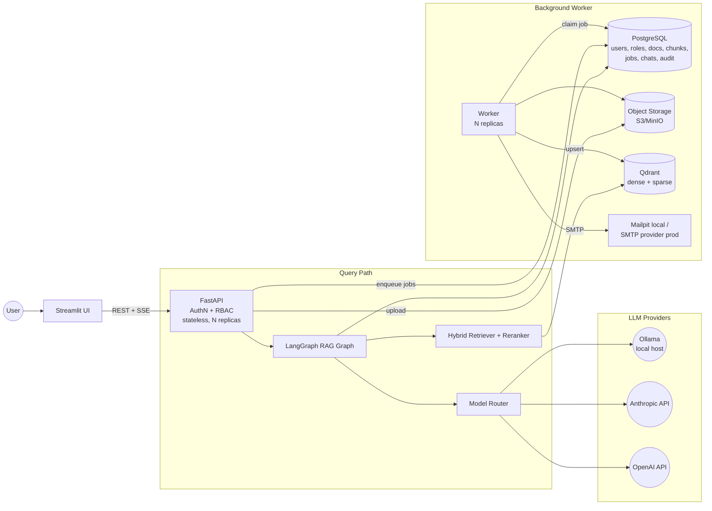
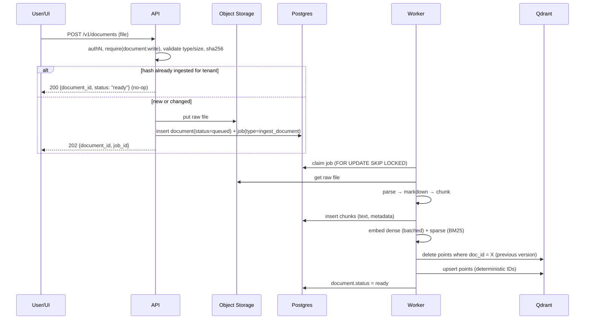
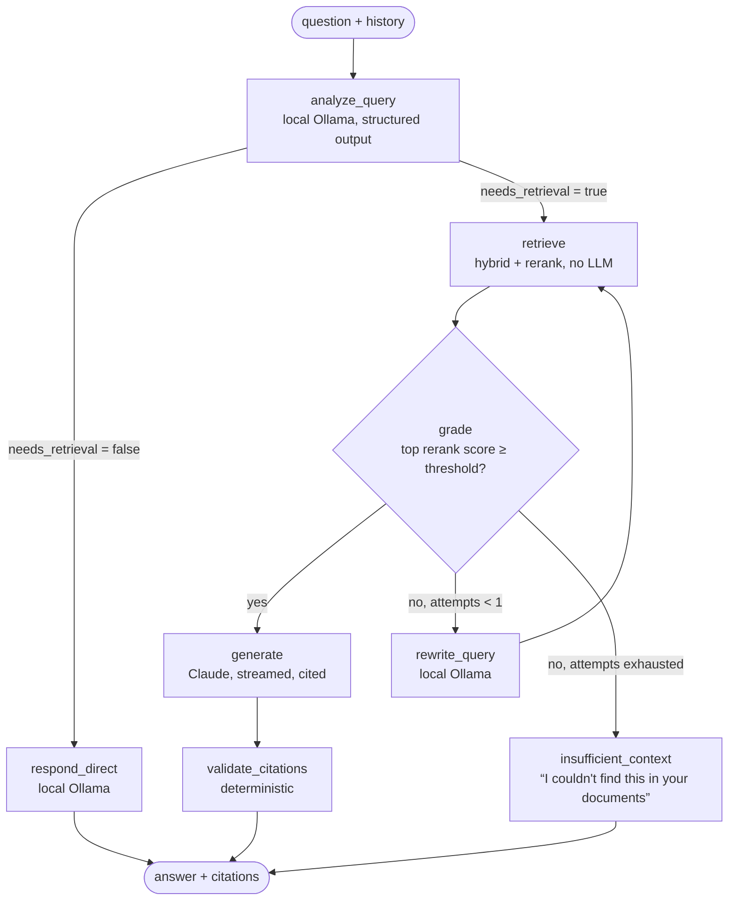

# MVP Architecture: Agentic RAG System

## 0. Review Notes

### Revision 2 — architecture review

| # | Before | Now | Why |
| --- | --- | --- | --- |
| 1 | 5 LLM agents (Supervisor, Router, Retriever, Generator, Critic) | One LangGraph state machine; only 2–3 nodes call an LLM | The graph *is* the supervisor. The old design made 5–8 LLM calls per query → slow, costly, hard to debug. |
| 2 | Dense-only vector search | Hybrid (dense + BM25 sparse) + cross-encoder reranker | Biggest retrieval-quality win per unit of effort; cheaper than agent loops. |
| 3 | Unbounded Critic → Retriever/Generator loops | Max 1 query-rewrite retry; deterministic grading via reranker score | Bounded latency and cost; no infinite loops. |
| 4 | Vector DB is the only store | Postgres = source of truth (docs, chunks, jobs, chats); Qdrant = derived index | Re-embedding, deletes, audit, and recovery become possible without re-parsing files. |
| 5 | Ingestion as a script | Async, idempotent jobs (content hash + deterministic point IDs) | Re-uploads don't duplicate; failures retry; API stays responsive. |
| 6 | "Qdrant or Chroma", "LangGraph or AutoGen", "Streamlit or Next.js" | One choice each, behind thin interfaces | Decisions made; vendor swaps isolated to adapters. |
| 7 | No conversation handling | Follow-ups condensed into standalone queries; history in Postgres | Chat follow-ups ("what about the second one?") otherwise retrieve garbage. |
| 8 | Evaluation in week 6 | Golden dataset in week 1; eval runs in CI | Every chunking/prompt/model change is measured, not guessed. |
| 9 | Missing | Multi-tenancy, prompt-injection handling, tracing, retries/timeouts | Cheap to add now, expensive to retrofit. |

### Revision 3 — platform requirements

| # | Requirement | Design | Section |
| --- | --- | --- | --- |
| 10 | Podman for localhost | `compose.yaml` + `Containerfile`, run with `podman compose`; Ollama runs on the host for GPU access | §7.1 |
| 11 | Mailpit for email | Transactional email via SMTP through a jobs-table outbox; Mailpit locally, real SMTP provider in prod via env only | §4.8 |
| 12 | RBAC | Tenant-scoped roles (`admin`, `editor`, `viewer`), permission checks as FastAPI dependencies, audit log | §4.7 |
| 13 | Local Ollama + Anthropic + OpenAI | Per-node model routing with ordered fallbacks; local `qwen3.5:4b` for orchestration steps, Claude for generation, OpenAI as fallback and eval judge | §4.3 |

---

## 1. Scope

**Goal:** Invited users of a tenant upload documents and ask questions in a chat UI; answers are grounded in those documents, streamed, and cite sources. When the documents don't contain the answer, the system says so. Access is controlled by role.

**MVP non-goals** (explicitly deferred): fine-tuning, GraphRAG, web search tools, OCR/scanned images (later: local `qwen3-vl` via Ollama), per-document ACLs (tenant-level roles only), custom roles, SSO/OIDC, agents with side-effecting tools, multi-region.

### Targets (MVP)

| Metric | Target |
| --- | --- |
| p95 time-to-first-token | < 3 s |
| Retrieval recall@8 on golden set | ≥ 0.85 |
| Faithfulness (golden set) | ≥ 0.90 |
| Ingestion | 100-page PDF searchable in < 2 min |
| LLM calls per query | ≤ 3 (typical: 2, of which 1 is local) |

---

## 2. Technology Stack

| Concern | Choice | Notes |
| --- | --- | --- |
| Language / tooling | Python 3.12, `uv`, `ruff`, `mypy`, `pytest` | |
| API | FastAPI + Pydantic v2 | SSE for streaming (simpler than WebSockets, works through proxies) |
| Orchestration | LangGraph | Graph only; LLM SDKs called directly via thin adapters (no LangChain chat-model layer) |
| LLM — orchestration steps | Ollama `qwen3.5:4b` (local, host) | Query analysis, rewrite, direct replies. Fallback: Claude Haiku 4.5 |
| LLM — generation | Anthropic Claude Sonnet 5.5 | Fallback: OpenAI (model set in config) |
| LLM — eval judge | OpenAI (model set in config) | Different vendor from the generator avoids self-preference bias |
| LLM SDKs | `anthropic`, `openai`, `ollama` | One adapter each behind an `LLM` protocol (§4.3) |
| Embeddings (dense) | `text-embedding-3-small` (1536-d) or an Ollama embedding model (e.g. `bge-m3`, 1024-d) | Fixed per collection; switching = re-index via alias (§4.5) |
| Sparse / keyword | BM25 via `fastembed` (CPU, local) | Stored as Qdrant sparse vectors |
| Reranker | `bge-reranker-v2-m3` (local cross-encoder) | Behind a `Reranker` protocol |
| Vector DB | Qdrant | Native hybrid search + RRF fusion, payload indexes, multi-tenancy, horizontal scaling |
| Relational DB | PostgreSQL 16 + SQLAlchemy 2 (async) + Alembic | Source of truth; job queue; LangGraph checkpointer |
| Job queue | Postgres `jobs` table + `SELECT … FOR UPDATE SKIP LOCKED` worker | Ingestion, email, re-index jobs. No extra infra for MVP |
| File storage | S3-compatible (MinIO locally) | Raw uploads, immutable |
| Parsing | `pymupdf4llm` (PDF → Markdown), `python-docx`, `trafilatura` (HTML) | Add Docling/Unstructured later for complex layouts |
| Auth | Email + password (`argon2id`), JWT access + rotating refresh tokens, API keys for service accounts | `pwdlib`/`argon2-cffi`, `pyjwt` |
| Authorization | RBAC, 3 fixed roles per tenant, permissions in code | §4.7 |
| Email | `aiosmtplib` + Jinja2 templates; **Mailpit** locally | Outbox via jobs table (§4.8) |
| Observability | OpenTelemetry + Langfuse, structured JSON logs | Langfuse is an optional compose profile locally (it's heavy) |
| Evaluation | Retrieval metrics + RAGAS (faithfulness, answer relevancy) | |
| UI | Streamlit (MVP, multipage) | Talks only to the public API; replaceable by React/TS |
| Containers | **Podman** (rootless) + Compose spec (`compose.yaml`) | Same OCI images in prod |

---

## 3. High-Level Design (HLD)

Two independent paths share storage: **Ingestion (write path)** and **Query (read path)**. Every request passes **AuthN → RBAC** before reaching either.



**Layering inside the codebase** (dependencies point inward):

```text
api (routers, auth deps) ──> use cases (graph, ingestion, auth, email) ──> domain models
                                        │
                                        └──> adapters (LLM, Embedder, VectorStore, Reranker,
                                                       ObjectStorage, Mailer, DB repositories)
```

Only vendor-swap points get a `Protocol`: `LLM`, `Embedder`, `VectorStore`, `Reranker`, `Mailer`. Nothing else is abstracted.

---

## 4. Low-Level Design (LLD)

### 4.1 Ingestion Pipeline



#### Steps & rules

1. **Parse** to Markdown so headings survive.
2. **Chunk** — structure-aware: split on headings first, then recursively by tokens.
   - Start at **~500 tokens, 50 overlap**; tune using the eval set.
   - Prepend the heading path to each chunk's embedded text (`"Guide > Install > Linux\n\n<chunk>"`).
3. **Embed** in batches (e.g. 64) with retry/backoff on 429/5xx.
4. **Idempotency**
   - Document dedupe: `(tenant_id, content_hash)` unique.
   - Point ID: `uuid5(NAMESPACE, f"{document_id}:{version}:{chunk_index}")` — re-running a job overwrites, never duplicates.
   - Re-upload of a changed doc: bump `version`, delete old points by `doc_id`, upsert new.
5. **Failure handling** — `attempts` incremented with exponential backoff; after 3 → `status=failed`, error surfaced in UI, and a `send_email` job notifies the uploader.
6. **Delete** — removes Qdrant points by filter, then chunks, then marks document deleted (raw file purged asynchronously). Recorded in `audit_log`.

### 4.2 Query Graph (Agentic / Corrective RAG)



| Node | Model route | Responsibility |
| --- | --- | --- |
| `analyze_query` | `orchestration` | One call returns `{standalone_query, needs_retrieval, filters}`. Condenses follow-ups using last N turns. |
| `respond_direct` | `orchestration` | Greetings, "what can you do", polite out-of-scope refusal. No document content. |
| `retrieve` | — | Qdrant hybrid query (dense + sparse prefetch, RRF, top 40) → rerank → top 8. Tenant filter always applied. |
| `grade` | — | Threshold on reranker score (tuned on eval set). |
| `rewrite_query` | `orchestration` | Reformulates once (synonyms / HyDE-style). Bounded to 1 retry. |
| `generate` | `generation` | Answers only from numbered context blocks; cites `[1]`, `[2]`. Streams tokens. |
| `validate_citations` | — | Drops citation markers that don't map to a retrieved chunk; attaches source metadata. |
| `insufficient_context` | — | Fixed honest response + suggestion to upload relevant docs. |

#### Graph state

```python
class RAGState(TypedDict):
    tenant_id: str
    user_id: str
    conversation_id: str
    question: str
    history: list[ChatTurn]          # last N turns, loaded from Postgres
    standalone_query: str
    needs_retrieval: bool
    filters: dict[str, str]
    chunks: list[ScoredChunk]
    attempts: int
    answer: str
    citations: list[Citation]
    models_used: list[ModelUsage]    # provider, model, tokens, latency, fallback flag
```

**Why no LLM Critic in the hot path?** It doubles latency and cost. Faithfulness is measured offline (eval suite, OpenAI judge) and on a sampled % of production traffic asynchronously. If eval shows hallucination problems, add an inline groundedness check behind a feature flag.

**Extending to multi-agent later:** new capabilities (SQL agent, web search, summarization) are added as subgraphs selected by `analyze_query`'s output, each with its own model route. The state contract and API do not change.

### 4.3 LLM Provider Layer & Model Routing

Three providers, one interface, routing by **purpose** (not by node), with ordered fallbacks.

```python
class LLM(Protocol):
    provider: str
    model: str

    async def complete(
        self,
        messages: list[Message],
        *,
        schema: type[BaseModel] | None = None,   # structured output when set
        max_tokens: int,
        temperature: float = 0.0,
    ) -> Completion: ...                          # text | parsed, usage, latency

    def stream(self, messages: list[Message], *, max_tokens: int) -> AsyncIterator[str]: ...
```

| Adapter | SDK | Structured output | Notes |
| --- | --- | --- | --- |
| `OllamaLLM` | `ollama` (native `/api/chat`) | `format=<JSON schema>` | `think=False` for Qwen3.x on orchestration calls (latency); `keep_alive` set so the model stays loaded |
| `AnthropicLLM` | `anthropic` | Structured outputs / tool schema | Prompt caching on static system prompt |
| `OpenAILLM` | `openai` | Structured outputs (`response_format` JSON schema) | |

Every structured response is **re-validated with Pydantic** regardless of provider — small local models occasionally emit invalid JSON.

**Routing config** (`config/models.yaml`, overridable by env):

```yaml
providers:
  ollama:    { base_url: "${OLLAMA_BASE_URL}" }        # http://host.containers.internal:11434 in containers
  anthropic: { api_key_env: ANTHROPIC_API_KEY }
  openai:    { api_key_env: OPENAI_API_KEY }

routes:  # first entry = primary, rest = fallbacks in order
  orchestration:
    - { provider: ollama,    model: "qwen3.5:4b",        timeout_s: 8 }
    - { provider: anthropic, model: "claude-haiku-4-5",  timeout_s: 8 }
  generation:
    - { provider: anthropic, model: "claude-sonnet-5-5", timeout_s: 60 }
    - { provider: openai,    model: "${OPENAI_GENERATION_MODEL}", timeout_s: 60 }
  eval_judge:
    - { provider: openai,    model: "${OPENAI_JUDGE_MODEL}", timeout_s: 60 }
```

**`ModelRouter.for_purpose("orchestration")`** returns an `LLM` that tries each entry in order and falls through on: timeout, connection error (e.g. Ollama not running), 429/5xx after retries, or a structured output that fails Pydantic validation twice. Fallbacks are logged and counted (`llm_fallback_total{purpose,from,to}`).

Rules:

- **Streaming fallback** happens only before the first token is sent; after that, errors surface as an SSE `error` event (no mixing two models in one answer).
- Prompts are provider-neutral (plain system + user messages; no vendor-specific tags required for correctness).
- Swapping a model is a config change, then an **eval run** — the eval suite can run the `generation` route against each provider and report the results side by side.
- Sensitive tenants can later be pinned to a local-only route (`generation: [ollama/...]`) — no code change.

**Why local Ollama for orchestration?** These calls are short, structured, and on the critical path before generation: a local 4B model on Apple Silicon is fast, free, and keeps raw user questions local. Cloud fallback covers quality failures and "Ollama is down".

### 4.4 Prompting rules (generation)

- Retrieved text is wrapped in delimited blocks (`<doc id="1" source="...">…</doc>`) and the system prompt states it is **data, not instructions** (prompt-injection mitigation).
- "Answer only from the documents. If they don't contain the answer, say so."
- Prompts live in versioned files under `graph/prompts/`; prompt version is logged on every trace.

### 4.5 Data Model

#### PostgreSQL (source of truth)

```text
-- Identity & access
tenants          (id, name, created_at)
users            (id, email UNIQUE, password_hash, is_active, last_login_at, created_at)
memberships      (user_id, tenant_id, role[admin|editor|viewer], created_at)
                  PK (user_id, tenant_id)
email_tokens     (id, type[invite|password_reset], email, tenant_id NULL, role NULL,
                  token_hash, expires_at, used_at, created_by, created_at)
refresh_tokens   (id, user_id, token_hash, expires_at, revoked_at, replaced_by, created_at)
api_keys         (id, tenant_id, name, role, key_prefix, key_hash, last_used_at,
                  revoked_at, created_by, created_at)
audit_log        (id, tenant_id, actor_user_id, action, target_type, target_id,
                  metadata JSONB, ip, created_at)

-- Content
documents        (id, tenant_id, uploaded_by, title, source_uri, mime_type, content_hash,
                  version, status[queued|processing|ready|failed|deleted],
                  error, created_at, updated_at)
                  UNIQUE (tenant_id, content_hash)
chunks           (id, document_id, version, chunk_index, text, heading_path,
                  page_start, page_end, token_count)

-- Background work
jobs             (id, type[ingest_document|send_email|reindex], payload JSONB,
                  status[queued|running|done|failed], attempts, run_after,
                  locked_at, error, created_at)

-- Chat
conversations    (id, tenant_id, user_id, title, created_at)
messages         (id, conversation_id, role, content, citations JSONB, trace_id,
                  prompt_version, provider, model, fallback_used, tokens_in,
                  tokens_out, latency_ms, created_at)
feedback         (message_id, user_id, rating SMALLINT, comment, created_at)
```

All tokens (invite, reset, refresh, API key) are stored **hashed** (SHA-256 of a 32-byte random secret); the plaintext is shown/sent once.

#### Qdrant (derived index — fully rebuildable from `chunks`)

- Collection `chunks_v{n}` accessed via alias `chunks_current` → zero-downtime re-embedding (e.g. switching to an Ollama embedding model): build `chunks_v2`, flip alias, drop `v1`.
- Vectors: `dense` (size from config, cosine), `sparse` (BM25, IDF modifier).
- Payload indexes: `tenant_id` (keyword, `is_tenant=true`), `doc_id`, `category`.
- Payload:

```json
{
  "tenant_id": "t_123",
  "doc_id": "uuid",
  "doc_version": 2,
  "chunk_index": 14,
  "text": "chunk text…",
  "heading_path": "Guide > Install > Linux",
  "source": "install-guide.pdf",
  "page": 7,
  "category": "technical_spec",
  "embedding_model": "text-embedding-3-small"
}
```

Single collection with `tenant_id` partitioning; the filter is enforced inside the `VectorStore` adapter so no caller can forget it.

### 4.6 API Contract (v1)

| Method | Path | Permission | Description |
| --- | --- | --- | --- |
| `POST` | `/v1/auth/login` | public | Email + password → access token + refresh cookie/token |
| `POST` | `/v1/auth/refresh` | refresh token | Rotate refresh token, new access token |
| `POST` | `/v1/auth/logout` | authenticated | Revoke refresh token |
| `POST` | `/v1/auth/password/forgot` | public | Always `202` (no account enumeration); emails reset link if user exists |
| `POST` | `/v1/auth/password/reset` | reset token | Set new password; revokes all refresh tokens |
| `POST` | `/v1/invitations` | `member:manage` | `{email, role}` → emails invite link |
| `POST` | `/v1/invitations/accept` | invite token | Create user (or attach existing) + membership |
| `GET` | `/v1/me` | authenticated | User, current tenant, role, permissions (UI uses this to show/hide actions) |
| `GET` | `/v1/members` | `member:manage` | List members |
| `PATCH` | `/v1/members/{user_id}` | `member:manage` | Change role (cannot demote the last admin) |
| `DELETE` | `/v1/members/{user_id}` | `member:manage` | Remove membership |
| `GET/POST/DELETE` | `/v1/api-keys` | `apikey:manage` | Service-account keys with a role |
| `GET` | `/v1/audit-log` | `audit:read` | Paginated |
| `POST` | `/v1/documents` | `document:write` | Multipart upload → `202 {document_id, job_id}` |
| `GET` | `/v1/documents`, `/v1/documents/{id}` | `document:read` | List / status, error, chunk count |
| `DELETE` | `/v1/documents/{id}` | `document:delete` | Remove doc + vectors |
| `POST` | `/v1/chat` | `chat:use` | `{conversation_id?, message, filters?}` → **SSE stream** |
| `GET` | `/v1/conversations`, `/v1/conversations/{id}` | `chat:use` (own only) | Messages with citations |
| `POST` | `/v1/messages/{id}/feedback` | `chat:use` (own only) | `{rating, comment?}` |
| `GET` | `/healthz`, `/readyz` | public | Readiness checks Postgres + Qdrant; reports Ollama reachability (degraded, not failed) |

#### SSE events from `/v1/chat`

```text
event: status     data: {"step": "retrieving"}
event: token      data: {"text": "The install "}
event: citations  data: [{"n":1,"doc_id":"…","source":"install-guide.pdf","page":7,"snippet":"…"}]
event: done       data: {"message_id":"…","conversation_id":"…"}
event: error      data: {"code":"llm_unavailable","message":"…"}
```

`tenant_id` and `user_id` come from the token, never from the request body.

### 4.7 Authentication & RBAC

#### Roles and permissions (tenant-scoped)

| Permission | viewer | editor | admin |
| --- | :---: | :---: | :---: |
| `chat:use` (own conversations only) | ✓ | ✓ | ✓ |
| `document:read` (list docs, see sources) | ✓ | ✓ | ✓ |
| `document:write` (upload, re-index) | | ✓ | ✓ |
| `document:delete` | | ✓ | ✓ |
| `member:manage` (invite, change role, remove) | | | ✓ |
| `apikey:manage` | | | ✓ |
| `audit:read` | | | ✓ |

- Roles and their permission sets are defined **in code** (`Role` and `Permission` enums + a `ROLE_PERMISSIONS` map). No roles table, no policy engine — move to DB-defined roles only when customers need custom roles.
- A user can belong to several tenants with different roles. The access token carries `sub` (user) and `tid` (active tenant); switching tenant issues a new token.
- **The role is loaded from `memberships` on every request** (one indexed lookup), not trusted from the JWT — role changes and removals take effect immediately.
- Enforcement is a FastAPI dependency on each route:

```python
@router.post("/v1/documents", status_code=202)
async def upload(
    file: UploadFile,
    ctx: Annotated[RequestContext, Depends(require(Permission.DOCUMENT_WRITE))],
) -> UploadAccepted: ...
```

- `RequestContext(user_id, tenant_id, role)` is passed into use cases and repositories; every tenant-owned query filters by `ctx.tenant_id`. Conversations additionally filter by `ctx.user_id` — **admins cannot read other users' chats**.
- Guardrails: the last admin of a tenant cannot be demoted or removed; users cannot change their own role.
- **Audit log** records: login failures (rate-limited), invites, role changes, member removal, API key create/revoke, document delete.

#### Authentication

- Passwords: `argon2id`; min length 12; login rate-limited per IP + email.
- Access JWT: 15 min, HS256 (secret from env) — switch to RS256 when other services verify tokens.
- Refresh token: 14 days, opaque, rotated on every use, stored hashed; reuse of a rotated token revokes the whole chain.
- API keys: `rk_<prefix>_<secret>`, tenant-bound with a role; same `require(...)` path.
- **Bootstrap:** `rag admin create --email … --tenant …` CLI creates the first tenant + admin (no open sign-up).

### 4.8 Email (Mailpit locally)

| Email | Trigger | Link expiry |
| --- | --- | --- |
| Invitation | Admin invites a member | 72 h, single use |
| Password reset | `/v1/auth/password/forgot` | 30 min, single use |
| Ingestion failed | Job reaches terminal `failed` | — |

- **Outbox pattern:** the API inserts a `send_email` job **in the same transaction** as the business change (e.g. the `email_tokens` row). The worker sends it with retries. No lost emails on SMTP failures; no emails for rolled-back transactions; requests never block on SMTP.
- `Mailer` protocol with one `SmtpMailer` (`aiosmtplib`). Jinja2 templates under `email/templates/` (HTML + plain-text versions).
- Links are built from `PUBLIC_UI_URL`; the token travels in the URL **fragment** or POST body, never logged.
- Config (env only, no code change between environments):

```text
SMTP_HOST=mailpit   SMTP_PORT=1025   SMTP_TLS=false   SMTP_FROM="RAG <no-reply@localhost>"   # local
SMTP_HOST=<provider> SMTP_PORT=587   SMTP_TLS=true    SMTP_USER/SMTP_PASSWORD from secrets  # prod
```

- Mailpit UI at `http://localhost:8025` to view sent mail. Integration tests assert on emails via Mailpit's REST API (`/api/v1/messages`) — e.g. "invite → read link from Mailpit → accept → login".

### 4.9 Project Structure

```text
rag-mvp/
├── pyproject.toml
├── compose.yaml                # Podman: api, worker, ui, postgres, qdrant, minio, mailpit (+ langfuse profile)
├── Containerfile               # one image; api / worker / ui chosen by command
├── .env.example
├── config/models.yaml          # model routes + fallbacks
├── src/rag/
│   ├── api/                    # routers, schemas, SSE, error handlers
│   ├── auth/                   # passwords, jwt, refresh tokens, api keys, rbac (Role, Permission, require)
│   ├── core/                   # config (pydantic-settings), logging, errors, telemetry
│   ├── domain/                 # Document, Chunk, Citation, ChatTurn, RequestContext (pure Pydantic)
│   ├── ingestion/              # parsers, chunker, pipeline
│   ├── retrieval/              # hybrid search + rerank + grading threshold
│   ├── graph/                  # state, nodes, graph builder, prompts/
│   ├── email/                  # templates/, send_email job handler
│   ├── worker/                 # job loop, handlers registry (ingest_document, send_email, reindex)
│   ├── adapters/
│   │   ├── llm/                # base.py (LLM protocol), ollama.py, anthropic.py, openai.py, router.py
│   │   ├── embedder.py, vectorstore.py, reranker.py, storage.py, mailer.py
│   ├── db/                     # SQLAlchemy models, repositories, alembic migrations
│   └── cli.py                  # admin bootstrap, reindex
├── ui/                         # Streamlit multipage app
├── evals/
│   ├── golden.jsonl            # {question, expected_doc_ids, reference_answer}
│   └── run_eval.py             # --route generation --provider anthropic|openai|ollama
└── tests/                      # unit, integration (testcontainers on Podman), RBAC matrix tests
```

---

## 5. Cross-Cutting Concerns

### 5.1 Reliability

- **Timeouts** on every external call (per-route LLM timeouts in `models.yaml`; embeddings 10 s; Qdrant 2 s; SMTP 10 s).
- **Retries** with exponential backoff + jitter (`tenacity`) on 429/5xx/connection errors only; then **model fallback** (§4.3).
- **Bounded loops**: graph `recursion_limit` set; max 1 rewrite.
- **Graceful degradation**: Ollama down → cloud fallback; reranker failure → RRF results; sparse failure → dense only. All logged as warnings with metrics.
- **Idempotent jobs**: ingestion via deterministic IDs; emails via job ID as `Message-ID` dedupe key; terminal `failed` state after max attempts.
- **Stateless API**: all state in Postgres/Qdrant; LangGraph checkpointer in Postgres.
- **Rate limiting** per tenant on `/v1/chat` and uploads; per IP + email on login and password reset.

### 5.2 Security

- AuthN/RBAC as in §4.7; tenant isolation enforced in repositories and the `VectorStore` adapter.
- **RBAC matrix test**: a parametrized test hits every route with every role and asserts allowed/denied — new routes without a `require(...)` fail CI.
- Upload validation: allow-listed MIME types (sniffed, not trusted from header), size cap (e.g. 25 MB), filename sanitization.
- Prompt injection: retrieved content delimited and labelled as data; no side-effecting tools in MVP.
- Data egress: document chunks go to the `generation` provider (Anthropic/OpenAI); orchestration steps stay local by default. Documented per route so tenants can be pinned to local-only later.
- Secrets (provider API keys, JWT secret, SMTP creds) via env / secret manager; never returned to the UI; `.env` git-ignored.
- No passwords, tokens, prompts or document text in application logs (traces in Langfuse with access control).

### 5.3 Observability

- One trace per request across API → graph nodes → LLM/embedding/Qdrant calls.
- Log per message: provider, model, `fallback_used`, prompt version, tokens, cost (Ollama = 0), latency per node, top rerank score.
- Dashboards/alerts: p95 latency, error rate, **fallback rate per route** (rising = Ollama or a provider is unhealthy), `insufficient_context` rate, thumbs-down rate, job failures (ingest + email).

### 5.4 Evaluation

- **Golden set** (50–100 real questions) with expected source documents.
- **Retrieval metrics** (deterministic): recall@k, MRR — on every change to chunking, embeddings, or retrieval.
- **Generation metrics**: RAGAS faithfulness + answer relevancy, judged by the `eval_judge` route (OpenAI).
- **Provider comparison**: same golden set run through each `generation` candidate (Claude, OpenAI, a local Ollama model) → quality, latency, and cost table that drives the routing config.
- **Orchestration check**: accuracy of `analyze_query` (`needs_retrieval` + standalone query) for the local model vs. the fallback — confirms the local 4B model is good enough.
- Runs in CI on PRs touching `ingestion/`, `retrieval/`, `graph/`, `config/models.yaml`; fails on regression beyond tolerance.

---

## 6. UI (Streamlit MVP, multipage)

The UI calls `/v1/me` and shows/hides actions by permission. **The API is the enforcement point**; hiding is UX only.

| Page | Who | Contents |
| --- | --- | --- |
| Login / Forgot password / Reset password / Accept invite | public | Token read from the link; set password |
| Chat | all roles | Streamed answers, status line from SSE `status` events, `[n]` citations with expandable **Sources** panel (doc, page, snippet), 👍/👎 feedback, own conversation list |
| Documents | `document:read` | Table with live status (`queued → processing → ready / failed`); upload + delete visible only with `document:write` / `document:delete` |
| Members | admin | Invite by email + role, change role, remove; pending invites |
| Settings | admin | API keys (create shows secret once, revoke); audit log viewer |

- **Debug toggle** (dev only): graph path, rewritten query, rerank scores, provider/model per node and whether a fallback fired.
- Model/temperature selection is not exposed to end users; it is server config.

---

## 7. Deployment

### 7.1 Local (Podman)

**Prerequisites (macOS):**

```bash
podman machine init --cpus 6 --memory 12288 --disk-size 60   # once
podman machine start
ollama serve                                                  # on the host (Metal GPU); not containerized
ollama pull qwen3.5:4b                                        # already installed
```

**Run:**

```bash
cp .env.example .env              # add ANTHROPIC_API_KEY, OPENAI_API_KEY
podman compose up -d              # core services
podman compose --profile observability up -d   # optional: Langfuse
podman compose exec api rag admin create --email you@example.com --tenant demo
```

`podman compose` delegates to the installed compose provider (`docker-compose` or `podman-compose`); `compose.yaml` uses only the Compose spec, so it is portable.

| Service | Image | Port(s) | Notes |
| --- | --- | --- | --- |
| `api` | app image | 8000 | `uvicorn rag.api.main:app` |
| `worker` | app image | — | `python -m rag.worker`; reranker model cached in a volume |
| `ui` | app image | 8501 | Streamlit |
| `postgres` | `postgres:16` | 5432 | named volume, healthcheck |
| `qdrant` | `qdrant/qdrant` | 6333, 6334 | named volume |
| `minio` | `minio/minio` | 9000, 9001 | named volume |
| `mailpit` | `axllent/mailpit` | 1025 (SMTP), 8025 (UI) | dev only |
| `langfuse` (profile) | Langfuse + its deps | 3000 | optional; heavy |
| Ollama | **host process** | 11434 | containers use `OLLAMA_BASE_URL=http://host.containers.internal:11434` |

Podman notes:

- **Ollama on the host**, not in a container: the Podman VM on macOS has no Metal GPU access, so containerized Ollama would run on CPU only. If containers can't reach it, start Ollama with `OLLAMA_HOST=0.0.0.0`.
- Use **named volumes** (not bind mounts) for data services — avoids rootless UID/permission issues and slow file sharing on macOS. On Linux with SELinux, bind mounts need `:Z`.
- `depends_on: { condition: service_healthy }` with healthchecks on postgres/qdrant so `api`/`worker` start in order; `api` runs `alembic upgrade head` on start in dev only.
- Integration tests use `testcontainers` against the Podman socket (`DOCKER_HOST=unix://$(podman machine inspect --format '{{.ConnectionInfo.PodmanSocket.Path}}')`, `TESTCONTAINERS_RYUK_DISABLED=true`).

### 7.2 MVP production

Same OCI image (built with `podman build`) deployed to a PaaS, or a single VM running **Podman Quadlet** (systemd-managed containers). Managed Postgres; Qdrant Cloud or self-hosted with snapshots; S3; real SMTP provider instead of Mailpit (env change only). Ollama on a GPU host if orchestration stays local in prod — otherwise point the `orchestration` route at Claude Haiku via config. Migrations run as a release step.

### 7.3 Scale path (only when a metric demands it)

| Component | MVP | Evolve when | To |
| --- | --- | --- | --- |
| API | 1–2 replicas | CPU/latency | More replicas behind LB (stateless) |
| Worker | 1 replica | Job backlog | More replicas (SKIP LOCKED already safe) |
| Queue | Postgres `jobs` | Sustained high job throughput | Redis (arq) or SQS |
| Vector DB | Single Qdrant node | > ~10M vectors or HA needed | Qdrant cluster (shards + replicas) |
| Local LLM | Ollama on one host | Concurrency (`OLLAMA_NUM_PARALLEL` saturated) | Multiple Ollama hosts behind LB, or vLLM |
| Reranker | Local CPU | Latency under load | GPU instance or hosted rerank API |
| Authz | 3 fixed roles | Custom roles / per-doc ACLs | DB-defined roles; doc ACL payload filter in Qdrant |
| Auth | Email + password | Enterprise customers | OIDC/SSO (keep RBAC unchanged) |
| UI | Streamlit | Product polish | React + TypeScript client on the same API |
| Agents | Corrective RAG graph | New use cases | Additional LangGraph subgraphs (SQL, web, tools) |

---

## 8. Implementation Plan (7 weeks)

### Phase 0 — Foundation (Week 1, days 1–3)

- Repo skeleton, `pyproject`, ruff/mypy/pytest, CI.
- `compose.yaml` + `Containerfile` with Postgres, Qdrant, MinIO, Mailpit; `podman compose up` green.
- Config via `pydantic-settings`; structured logging; OpenTelemetry wiring.
- LLM adapters (Ollama, Anthropic, OpenAI) + `ModelRouter` with fallbacks; smoke test hits all three.
- Draft golden eval set (≥ 50 Q&A with expected docs).
- **Exit:** all services healthy under Podman; a structured-output call succeeds on each provider; fallback fires when Ollama is stopped.

### Phase 1 — Identity, RBAC, Email (Weeks 1–2)

- Tenants, users, memberships, tokens, API keys, audit log; Alembic migrations.
- Login / refresh / logout; `require(...)` dependency; RBAC matrix test.
- `jobs` table + worker loop; `send_email` handler; invite + password-reset flows via Mailpit.
- Admin bootstrap CLI.
- **Exit:** invite → email in Mailpit → accept → login works end to end in an integration test; every role/route combination covered by the matrix test.

### Phase 2 — Ingestion (Weeks 2–3)

- Document endpoints (permission-guarded); object storage.
- `ingest_document` handler: parse, chunk, dense + sparse embed, Qdrant upsert with deterministic IDs; failure email.
- **Exit:** 100 docs ingested; re-upload is a no-op; deletion removes vectors; recall@k measured on golden set.

### Phase 3 — Retrieval + Baseline RAG (Weeks 3–4)

- Hybrid search with RRF, reranker, tenant filter enforcement.
- Single-pass generate (Claude) with citations; `/v1/chat` SSE; citation validation.
- **Exit:** baseline eval numbers recorded (recall@8, faithfulness, p95 TTFT); Claude vs. OpenAI comparison run.

### Phase 4 — Agentic Graph + Conversations (Weeks 4–5)

- LangGraph nodes: `analyze_query`, `respond_direct`, `grade`, `rewrite_query`, `insufficient_context` on the local `orchestration` route.
- Conversations/messages persistence (own-only access), history condensation, Postgres checkpointer.
- Tune grading threshold; measure local-model `analyze_query` accuracy vs. Haiku.
- **Exit:** eval ≥ Phase 3 baseline; follow-ups resolve correctly; ≤ 3 LLM calls/query; fallback rate < 5% in the eval run.

### Phase 5 — UI (Week 6)

- Streamlit pages: login/reset/accept-invite, chat, documents, members, settings.
- Permission-aware rendering via `/v1/me`; debug toggle.
- **Exit:** end-to-end demo with admin, editor, and viewer accounts.

### Phase 6 — Hardening & Launch (Week 7)

- Rate limits (chat, upload, login, reset); upload limits.
- Eval in CI with regression gate; dashboards and alerts (incl. fallback rate).
- Load test (e.g. Locust) against §1 targets, including Ollama concurrency.
- Build images with Podman; deploy; backup/snapshot for Postgres and Qdrant verified by a restore test.
- **Exit:** §1 targets met; runbooks for re-indexing, restore, and provider outage.

---

## 9. Key Decisions (ADR summary)

| Decision | Chosen | Rejected | Reason |
| --- | --- | --- | --- |
| Orchestration | LangGraph state machine | AutoGen; free-form multi-agent chat | Deterministic, testable control flow; checkpointing; extend with subgraphs |
| Agent count | 2–3 LLM nodes | 5 LLM agents | Latency, cost, debuggability; quality comes from retrieval |
| LLM access | Own thin adapters + `ModelRouter` (3 small files) | LiteLLM; LangChain chat models | Only 3 providers; need provider-specific structured output, prompt caching, and explicit fallback semantics. Revisit LiteLLM if providers grow beyond ~4. |
| Orchestration model | Local Ollama `qwen3.5:4b`, cloud fallback | Cloud-only | Free, low-latency on Apple Silicon, keeps questions local; fallback covers outages and quality misses |
| Generation model | Claude Sonnet 5.5, OpenAI fallback | Single provider | Provider outage doesn't take the product down; choice re-validated by eval |
| Retrieval | Hybrid + rerank | Dense only | Exact terms (IDs, error codes, names) fail with dense-only |
| Vector DB | Qdrant | Chroma, pgvector | Hybrid + multi-tenancy + clustering built in (pgvector viable if corpus stays small) |
| Source of truth | Postgres | Vector DB payloads | Rebuildable index, re-embedding, deletes, audit |
| Authorization | 3 fixed roles, permissions in code, role read from DB per request | DB-defined roles; Casbin/OPA | Enough for MVP, trivially testable; immediate revocation |
| Auth | Email/password + JWT + rotating refresh | OIDC now | No external IdP needed for MVP; OIDC slots in later without touching RBAC |
| Email | SMTP via jobs-table outbox; Mailpit locally | Sending inline; vendor SDK | No lost/phantom emails; provider swap is env-only |
| Queue | Postgres SKIP LOCKED | Celery/Redis | No extra infra at MVP volume |
| Containers | Podman (rootless) + Compose spec | Docker Desktop | Daemonless/rootless, no licensing concerns; Compose spec keeps it portable; Quadlet for single-VM prod |
| Streaming | SSE | WebSockets | One-way stream is enough; simpler infra |
| UI | Streamlit | Next.js (for now) | Speed to MVP; API-first so the UI is replaceable |
